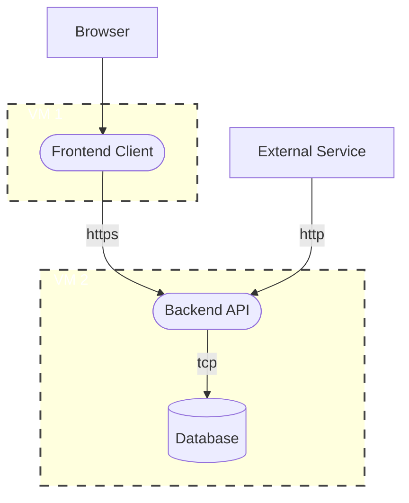

# Basic Threat Modelling

Threat modelling is the process of identifying potential threats to a system and developing strategies for mitigating those threats. By engaging in this process, organizations can proactively identify and address security risks, rather than waiting for a breach to occur. There are four key questions when doing a threat modelling:

1.  What are we working on?
2.  What can go wrong?
3.  What are we going to do about it?
4.  Did we do a good enough job?

First, read the [threat modeling manifesto](https://www.threatmodelingmanifesto.org/). Then we need to ask and answer the four questions.

## What Are We Working on?

When doing a threat modeling, the first thing to do is to select a scope of what we are threat moddeling. The next step is to understand what we are working on. How does the system work and how does the data flow (within the scope of the model)? This can be described with a data flow diagram (DFD).

To create a data flow diagram, follow these steps:

1. Identify the components of the system: Start by identifying the major components of the system, such as servers, databases, web applications, and mobile apps. 
	1. Use rounded boxes for internal components. 
	2. Use rectangled boxes for external components.
	3. Use sylinder for data storage.
2. Identify the data flows: For each component, identify the data flows that occur within and between components. This might include data being sent between a client and server, data being stored in a database, or data being processed by a web application.
	1. Use arrows to represent what directtion the data flows.
	2. Use labels on the arrows to tell what protocol is being used and what is sent.
3. Identify the trust bonderies: A trust boundary in a Data Flow Diagram (DFD) is a point in the system where data is transferred from one system or entity to another and where the level of trust between the two is defined. It represents the point where data crosses from one domain to another, and where different security requirements may apply. Identifying trust boundaries in a DFD is important for understanding the security requirements of a system and for ensuring that appropriate security measures are implemented at each point where data crosses between different domains.

An example of DFD:

With your data flow diagram in hand, you can now move on to the next step of the threat modelling process, which is identifying potential threats to the system.

## What Can Go Wrong?

Now that we have a scope and a model of our system, we need to understand what can go wrong. There are many methods to use, but here we use the STRIDE method. STRIDE is a acronym and is described in the table below.

|  | THREAT | DESCRIPTION |
|---|---|---|
| S | Spoofing | This includes threats where an attacker impersonates someone else in order to gain access to the system. |
| T | Tampering | This includes threats where an attacker modifies data in order to gain unauthorized access. |
| R | Repudiation | This includes threats where an attacker denies their actions or the actions of others, which can make it difficult to identify the source of an attack. |
| I | Information disclosure | This includes threats where an attacker gains access to confidential information, either by stealing it or by exploiting a vulnerability. |
| D | Denial of service | Overloading a reousrce with request or exploiting a vulnerability so it becomes unavailable for legitimit users. |
| E | Elevation of privilege | This includes threats where an attacker gains access to resources or privileges that they are not authorized to have, which can allow them to execute additional attacks. |

To use the STRIDE method, analyze each component of your system and identify potential threats in each of the six categories. Note that each STRIDE element can occur in multiple component types, and the specific vulnerabilities and attack vectors will depend on the nature of the component and how it interacts with other components in the system. The table below is meant to provide a general overview of where each STRIDE element can occur in a DFD.

| STRIDE ELEMENT | EXTERNAL ENTITIES | PROCESSES | DATA STORES | COMMUNICATIONS CHANNELS |
|---|:---:|:---:|:---:|:---:|
| Spoofing | X | X | X |  |
| Tampering |  | X | X | X |
| Repudiation |  | X | X | X |
| Information Disclosure | X | X | X |  |
| Denial of Service | | X | X | X |
| Elevation of Privilege | X | X | X |  |

When analyzing the system using STRIDE, fill out the first four columns in the table in the appendix. This will help you identify potential vulnerabilities and attack vectors, which you can then use to develop strategies to mitigate those risks. 

## What Are We Going to Do About It?

Once you have identified potential threats to your system using techniques like the STRIDE method, the next step is to develop strategies for mitigating those threats. For each potential threat, consider the following strategies:

| STRATEGY | DESCRIPTION |
|---|---|
| Accept | For threats that are low-risk or low-impact, it may be acceptable to simply accept the risk and not take any additional action. Before a thrat can be accepted it is important to determen who has the authority to accept thrats. The authorized entity could be the product owner or the data owner (but probably NOT the developer). |
| Mitigate | For threats that are moderate-risk or moderate-impact, consider implementing mitigations to reduce the risk or impact. This might include adding additional layers of security, implementing access controls, or applying patches to address known vulnerabilities. |
| Eliminate | For threats that are high-risk or high-impact, consider eliminating the threat altogether. This might include removing a component from the system or discontinuing a feature that poses a significant risk.
| Migrate | For threats that cannot be eliminated or mitigated, consider migrating the risk to another part of the system. For example, if a particular component cannot be secured, consider isolating it from other components to reduce the impact of a potential attack. |

By considering these strategies for each potential threat, you can develop a comprehensive plan for addressing the risks associated with your system. It's important to involve stakeholders from across your organization in this process, including developers, security professionals, and business leaders, to ensure that everyone is on board with the strategies that are selected. Continue to use the form in the appendix and fill out column five and six.

## Did We Do a Good Enough Job?

It is important to ask if we did a good enough job (column 7 and 8 in the table in the apendix). Additionally, it's important to continually monitor and update your model and mitigation strategies over time as new threats emerge and your system evolves. By following a continuous threat modelling process, you can ensure that your system remains secure and resilient against potential attacks.

## Appendix

| PART | THREAT | DESCRIPTION | SEVERITY | STRATEGY | ACTION | RESULT | REMARKS |
|:---:|:---:|---|:---:|:---:|---|:---:|---|
| A | Spoofing | ... | High | Mitigate | ... | WIP |  |
| B | Tampering | ... | Medium | Eliminate | ... |  |  |
| C | Tampering | ... | Low | Accept | ... | Completed |  |
|  |  |  |  |  |  |  |  |
